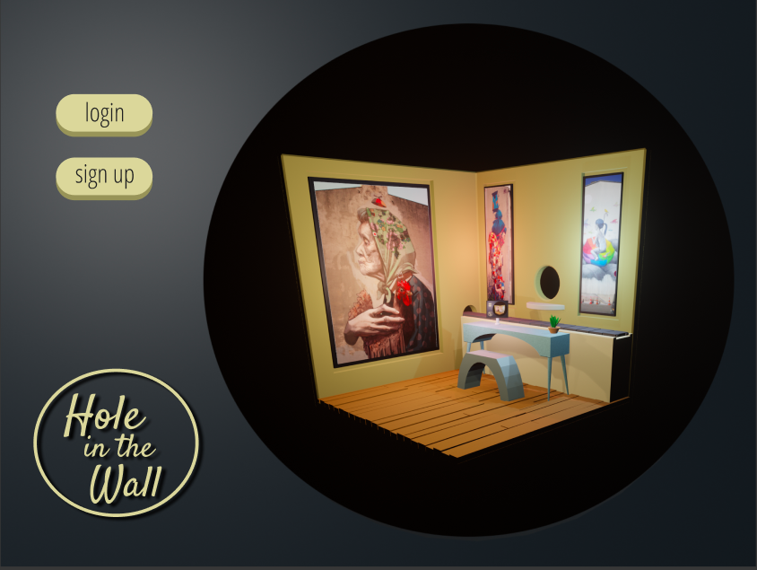
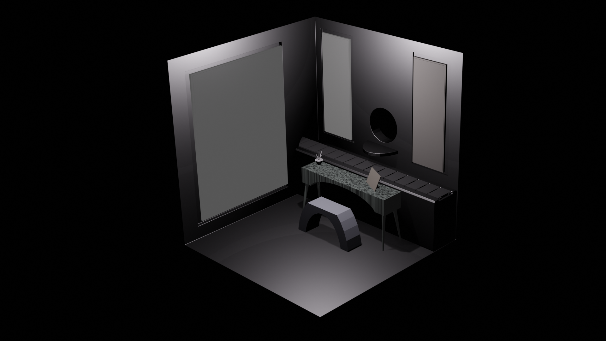
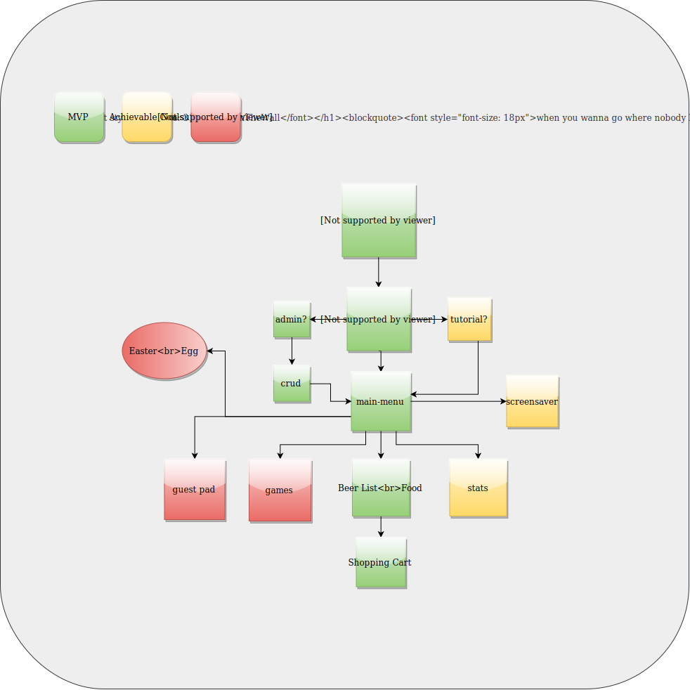

# Hole In The Wall
### When you wanna go where nobody knows your name

#### By _**Josh Mabry**_

## Intro
_This is my capstone project for Epicodus' Ruby on Rails / React Bootcamp. I wanted to showcase my wide range of skills as I attempt to join the tech community and become a full-stack React developer._

## Concept
_This project was inspired by solo dining ramen houses in Japan, where everyone sits at a bar separated into stalls after purchasing a ticket for soup at a vending machine. Food is served through windows in the wall by disembodied arms and everyone is expected to remain silent. I thought up the concept of a bar that ran in a similar fashion. Individual rooms where patrons place orders in a tablet at the table and receive their drinks through the window, a literal hole in the wall kinda place._

_This project is what I envisioned this bar's point of sale / data system would look like from both an employee and customers perspective. I hope to expand this to React 360_

## WireFrame

* I did my wire framing in figma
https://www.figma.com/file/gre3hBqQpACXZK713R4yQz/Hole-In-The-Wall?node-id=0%3A1

## ScreenShots

* Here is an early 3d model for one of the rooms

## Flowchart/MVP

## Technologies used
* ReactJS
* Redux
* Firebase
* VX Data Visualization Library
* Blender (3d modeling/animation)

## Setup/Installation Requirements

* Clone or download and run npm install
* Run npm run start and navigate to localhost:3000 in your browser

## Known Bugs
* Submit a pull request or contact Josh at mabry1985@gmail.com to report any bugs

### License

* _open source_

Copyright (c) 2019 **_Josh Mabry_**
